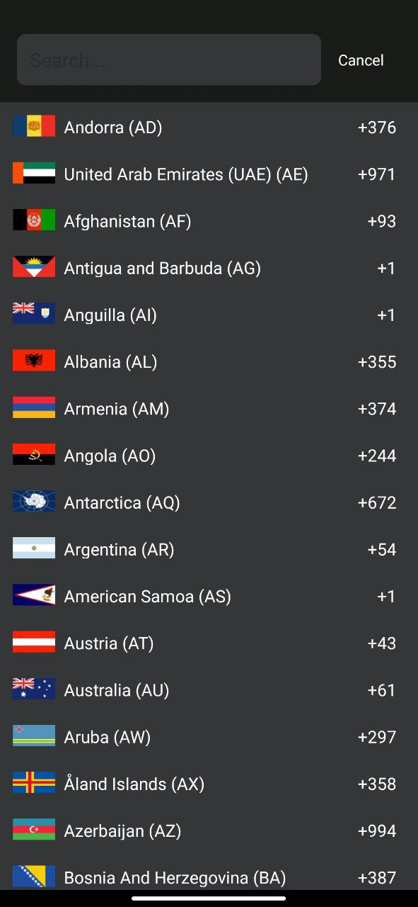

# PCP

[](https://jitpack.io/#MrAdkhambek/PCP)

```gradle
allprojects {
    repositories {
        ...
        maven { url 'https://jitpack.io' }
    }
}
```

```gradle
dependencies {
    implementation 'com.github.MrAdkhambek:PCP:$lastVersion'
}
```

```kotlin
    val pcpView = findViewById<PcpView>(R.id.pcp_view)
    pcpView.value // String
```





